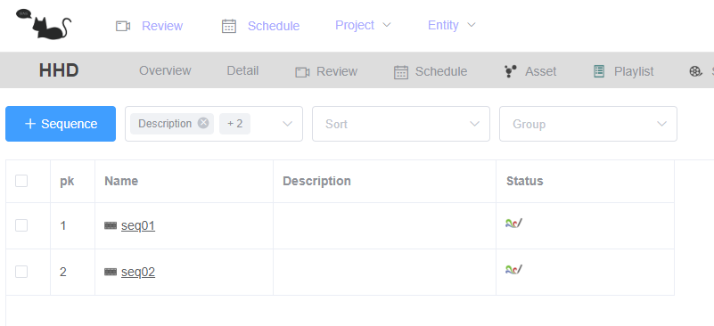
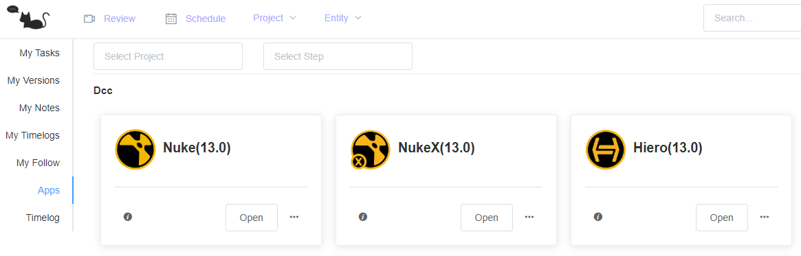
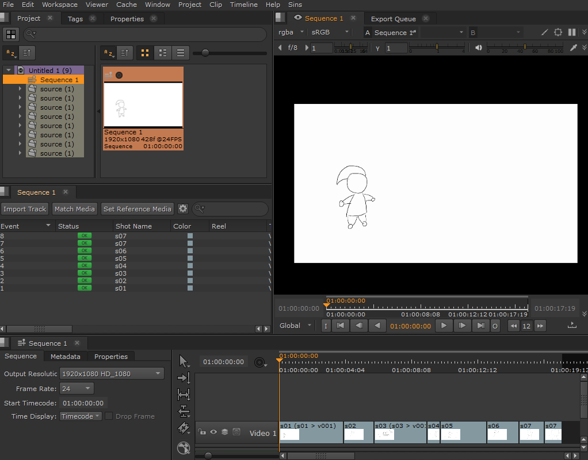
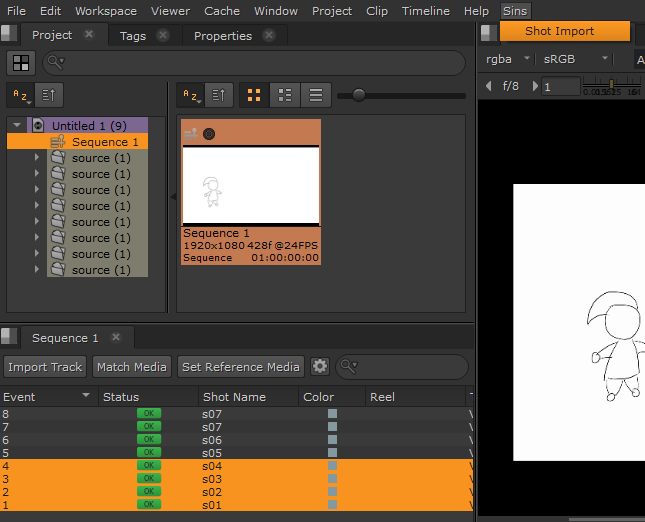
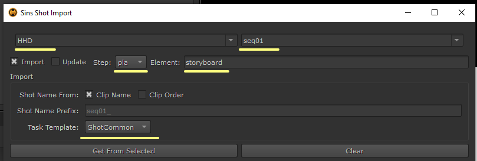
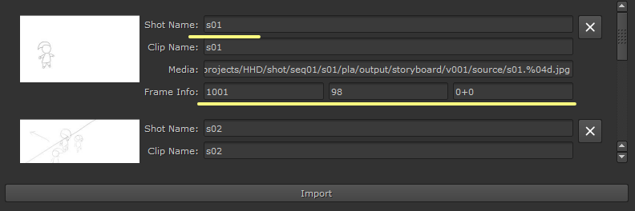
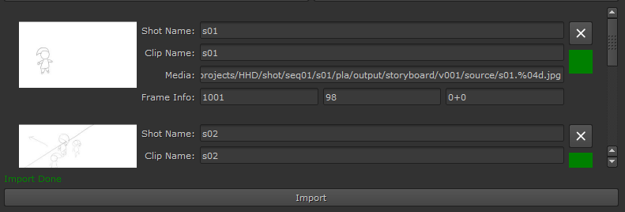
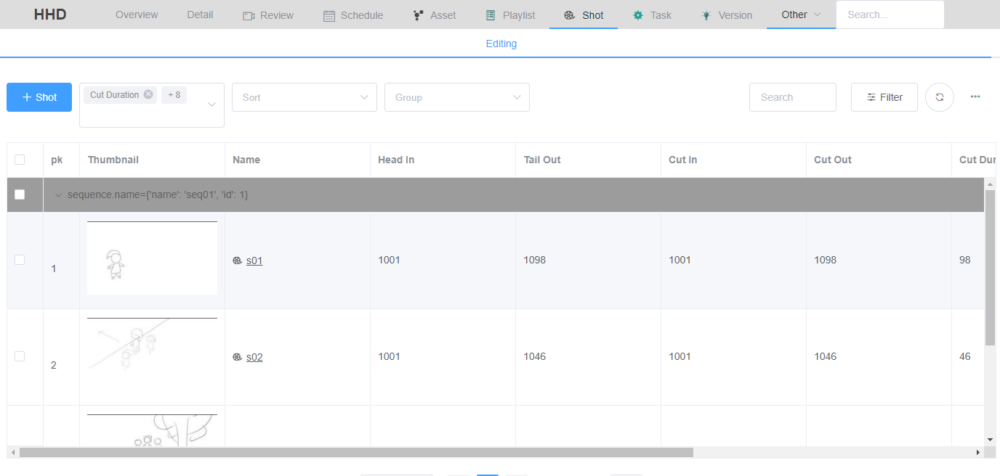
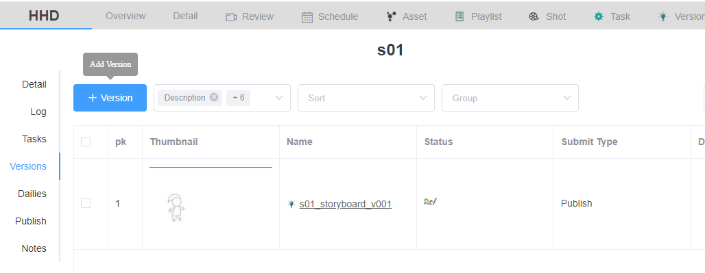
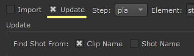

# Sins Hiero Tutorial

## Import Shots

Sins support create new shots or update shots information from hiero.

### Create New Shots

Let's say we have some image sequences which are exported from storyboard software and we need to create shots from these sequences.
The shot name should be based on sequence name and frame range should be same as image sequence. 
Also under the shots there should be some tasks, like ani and lgt.

* Firstly you need to make sure the project and sequence are created

* Open Hiero from 'Apps' page or 'sinsapp'

* Import the image sequences and put them in timeline

* Select the clips and open 'Shot Import' window

* Choose project and sequence. Choose the pipeline step and element you want to import media to.
Select a task template.

* Click 'Get From Select'. Check the shot name and shot information.

* Click 'Import' and wait for finish.

The the shots and tasks will be created in Sins. There will be also a storyboard version under pla step.

### Update Shots

If the storyboard changes, like frame range changes and you just need to update the frame range of shots.
You can choose 'Update' in the import window.

