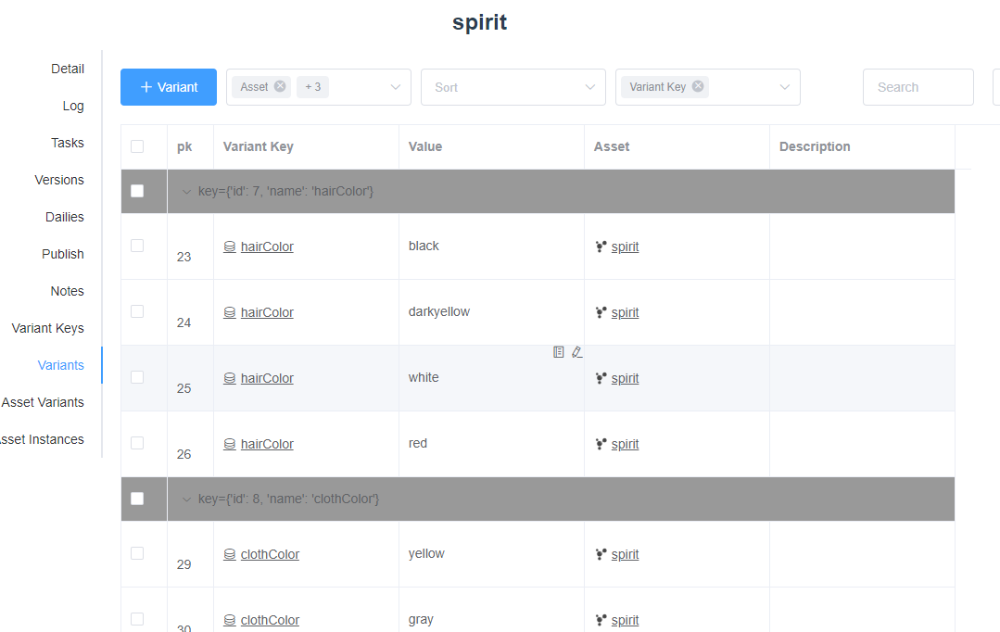
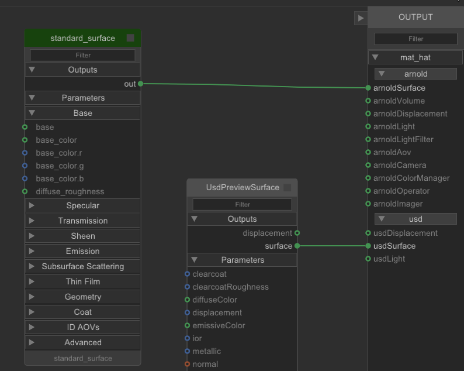

# Sins Katana Tutorial

## Initialize

This tool will import asset or shot template. 
The import part are all controlled by expression automatically. 
You don't need to care about where to import upstream files.
This will help you do lookdev or lighting work quickly.

## Asset Level

### Create and Switch Variants

Same as maya, you can create variants based on variant table.
Let's see the same spirit asset I did in maya. 
I hope it can has different color for each body part like hat, hair and cloth.

Firstly, I add the variant in Sins.

Then open variant window, choose 'hatColor', and select the variants, click 'Add'.

Then the variants are added in katana global variable.

Here I made different material override and use VariableSwitch nodes.

When I switch variants, the material will also change.

### Publish Lookdev

In katana, when you need to export and publish lookfile, you need to use the SinsLookFileBake node.
This node will be loaded in template, and the parameter will have expression.
You don't need to set the export path.

Select the SinsLookFileBake node and open lok publish window.
You need to select variants to export. It's same as mod publish.

The material you made should contain renderer shader(here I use arnold renderer) and usd shader.

After publish, you will get an asset usd file which has both render shader and usd shader assigned.
You can load this file in maya and in GL(Hydra) viewport, you will see the usd shader.
If you use arnold shader in katana, in maya Arnold(Hydra) viewport, you will see the arnold shader result.

Also, you can switch the lok variant in maya.

## Shot Level

### Sins Timeline

This node will help you view sequence result. It's included in the shot template. 
You can switch shot in the timeline view. The frame also changed.
It will be easy to compare the result between different frame from different shot.

### Publish Light

Many people may think the lighting should be the last step of an cg scene.
Sins support export light data, and you can view the light result at any step of shot.

For example, I did the lighting work and publish the light.

Back to layout or animation step, in maya or houdini, I pull the usd scene again. 
It will have the light.

Switch to Arnold(Hydra) view, I can see the lighting effect(will have some difference because of the rendersetting).

This allows you render the final scene at any step. 
You can start lighting before doing animation.

## Render

The SinsOutput node will help you set the render output path automatically.
You need to set the 'element' and 'aov' parameter value.

