# Sins Maya Tutorial

## Initialize

This tool will help you create default groups or import files to begin.

In asset task, it will create the |master|mod group.
In shot task, it will also import assets based on AssetInstance information.

For example, I have added some asset instances in Sins and link to shots.

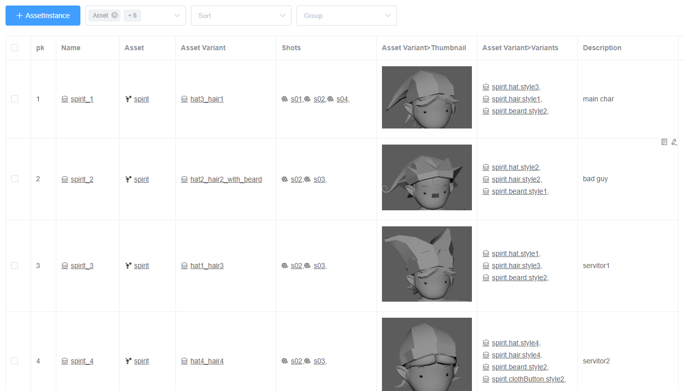

Then I need to do the animation in shot s02. 
After initialized, the rig will be imported with instance namespace and put into correct group.
The variant will also be set.

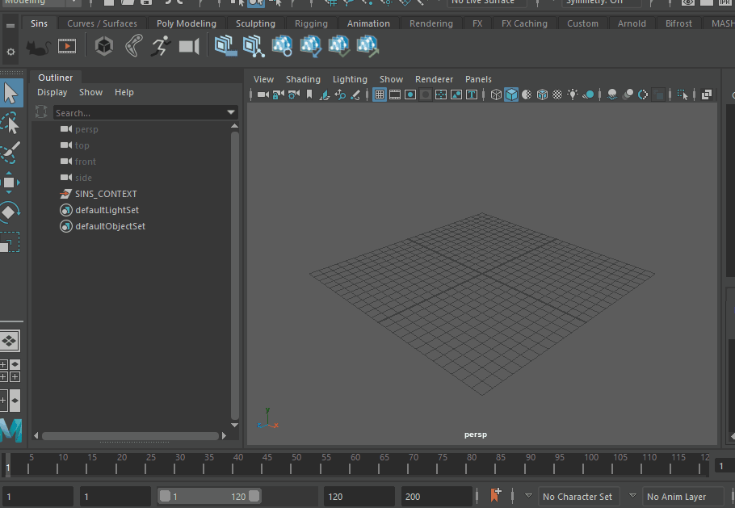

## Create and Switch Variants

Sins support create variants of one asset in one maya file. 
For example your asset has two different kinds of pattern: normal and hurt. 
Only some meshes are different and others are same. In this case, we can treat them as two variants of asset.
If most mesh are different, we suggest dividing it into two assets in Sins.

Let's see a complicated situation. 
Here we have a spirit asset which may has some different kinds of hat, hair and beard. 
And in some scene we may have lots of spirits with different parts combined.
If we define each kind as an asset, there will be many same assets in Sins.
So we can use variant to do this.

Firstly in maya, we do the model and put different parts in different groups.

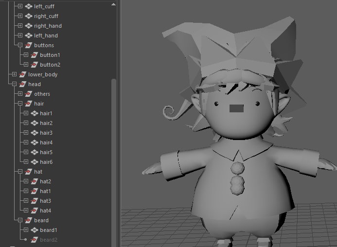

In Sins 'Variant' table, we need to create the entity for these.

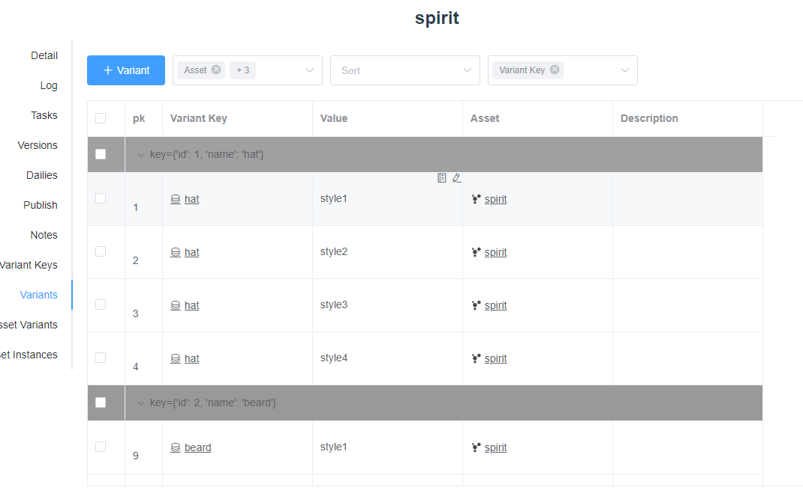

Then open variant window, select 'hat1' group and choose 'hat' and 'style1', click 'Add'.

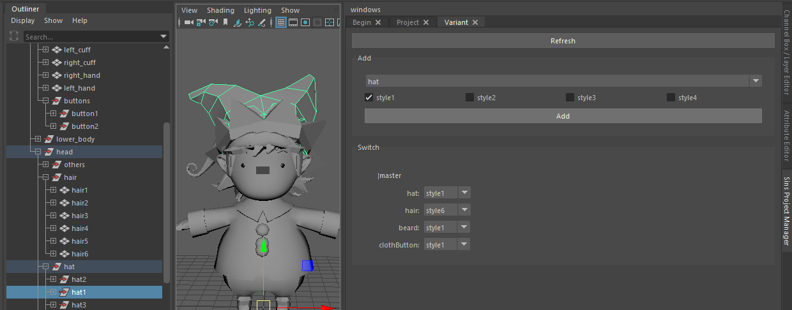

Do the same operation to other groups.
Then in the switch box, you can choose variant for each key and click 'Apply'.
You should see the variant changes in maya scene.

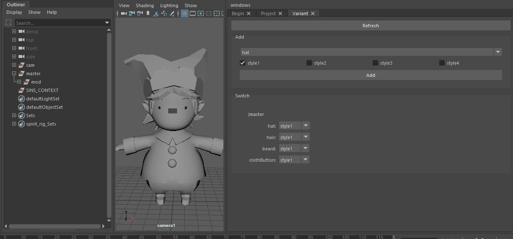

In this way, we will have many variants with different kay and value combined. 
We don't need to do it in different maya file or copy same parts. 

The variant concept can also be used to switch lod, or material in katana.

## Playblast

You can add suffix after playblast version element.

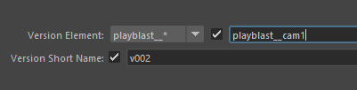

After submit, you should be able to see the preview in 'Review' page.

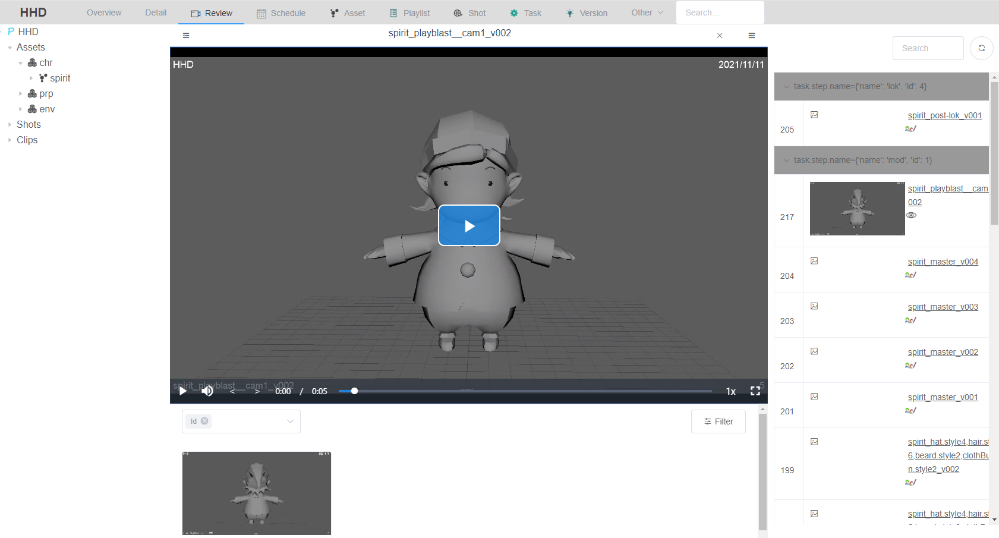

## Import

### Import rig as reference

When import rig from project manager window, it will help you create some groups, like '|master|geo|chr'.

## Export

### mod

If you add variants, the mod publish window will let you choose which variants need to be exported.
By default, all variants will be exported. You can only choose some of them, or choose 'Export as one'(This will not create variant in usd file).

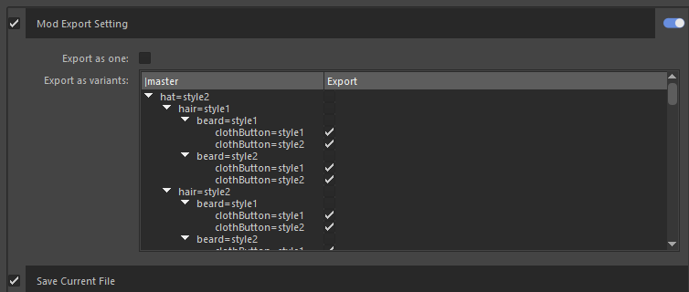

Then in the master version usd file, you can switch the variant.

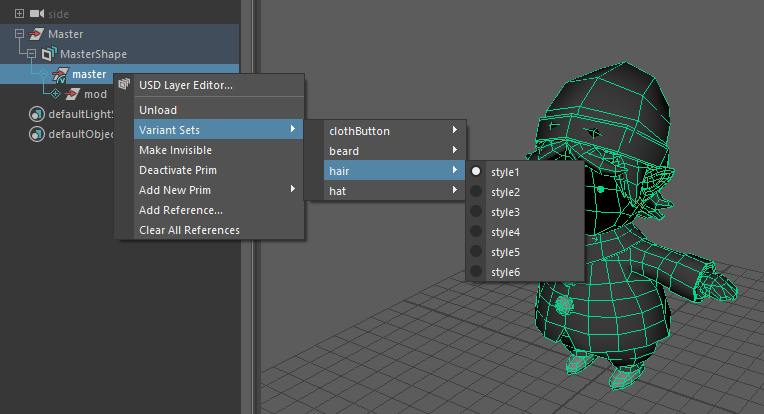

### component

Component can be used if your model has many repeat little thing, like bricks on the ground.
You can export the brick as component and import as usd and assemble in usd stage, then publish a usd file.

Here I have a bookshelf asset, which should contains some different kinds of books. 
I can create a book asset for this, but can also use component.

Firstly, save the maya file as 'book' element.

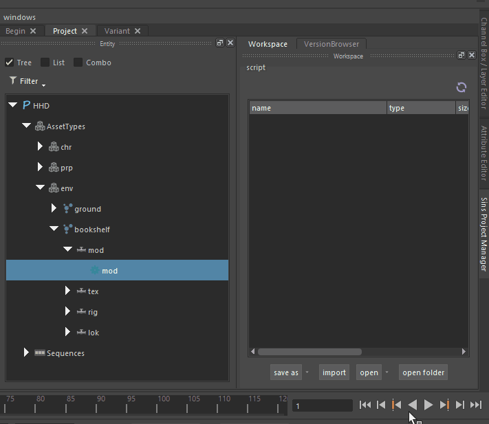

I also added 2 variants for book.

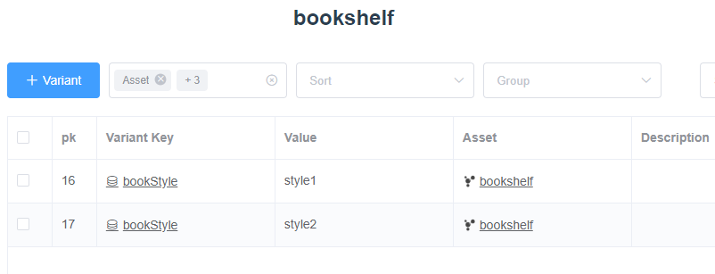

Publish the book as same as mod publish.

Then I create new maya scene as master element for bookshelf and make the shelf part.

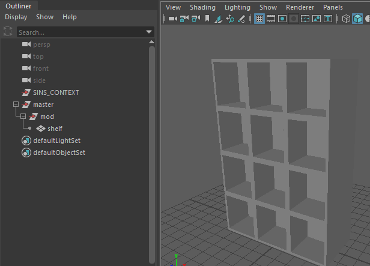

Create a new usd file and import.

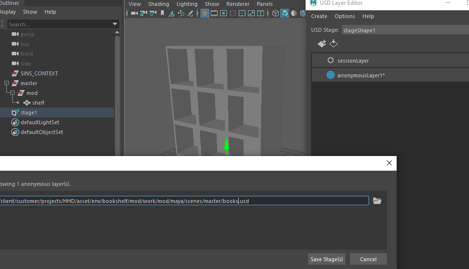

Reference the book component usd file in this stage. I can also switch the component variant here.

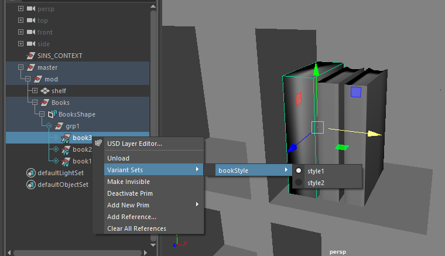

Publish this using mod publish and I can get the final result usd.

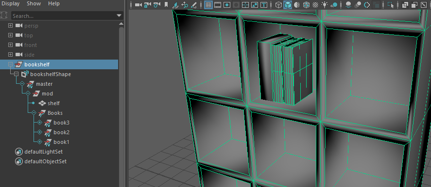

### rig

The rig is same as mod, you should choose which variants need to be exported.
By default, it will be export as one.

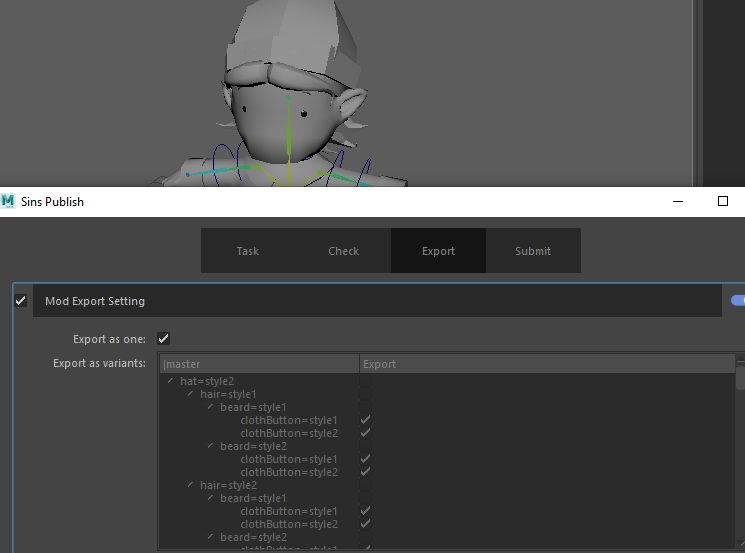

### ani

The animation publish window will show all referenced assets and their variants.
Current variant is selected to be exported.

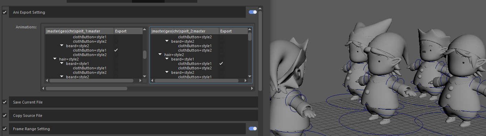

After publish, you will get a shot ani usd file which contain the animation data and lookdev data.

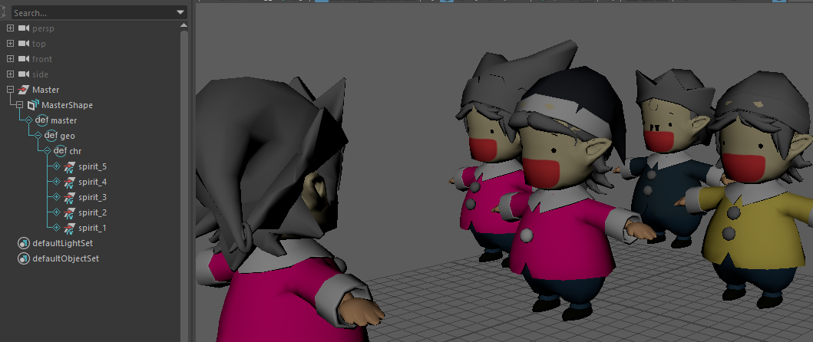

Here I add lok variants into asset variant.

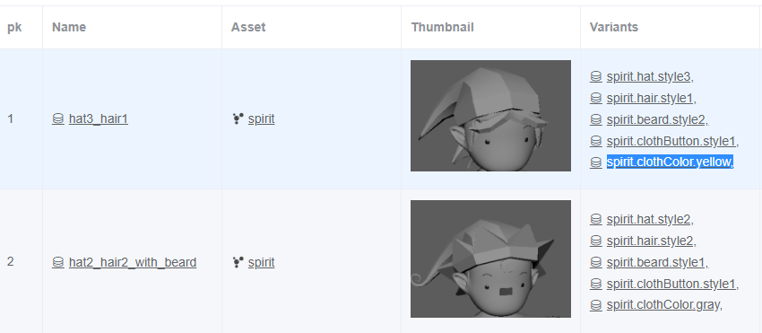

The exported animation will also have correct material.

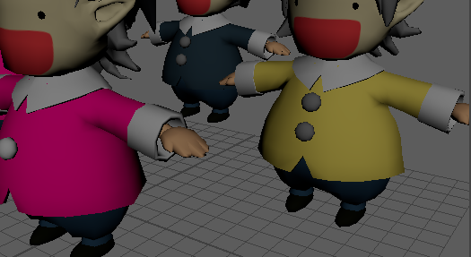

### cam

## Usd Tools

### Create usd shots

This will create default usd files for steps in 'usdShotLayerStack' preset.
You should do this before shot work.
The base shot usd file will be used as base layer in other shots.
So you can do some base layout in base shot, and it will also show in other shots.

For example, I import a set asset in s01(base shot of s02, s03 and s04) in lay task.

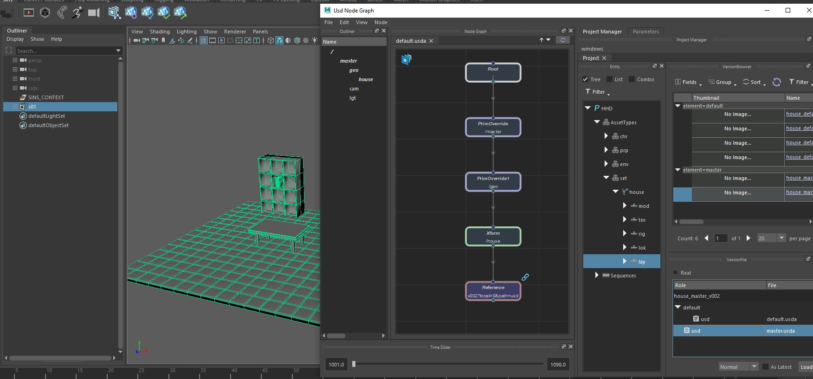

After publish, I pull from s02. The asset is also here.
Then I can do some override in current shot. The final layout result of s02 will have the override changes.

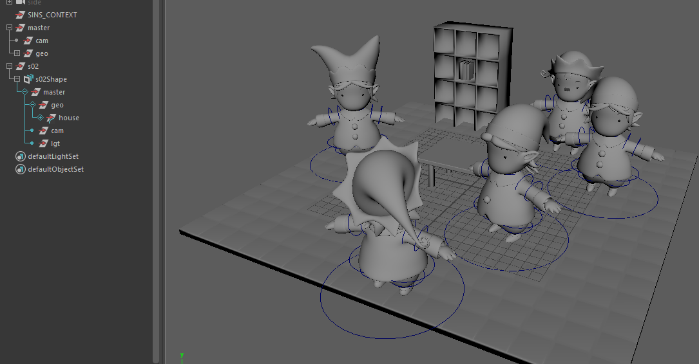

### Usd pull

You can get the latest usd file of current asset(set) or shot.

* Asset level

    You should use this tool in a lay task. First time you will get an empty scene.
    
    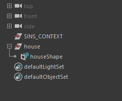

* Shot level

    You can use this in any step(in 'usdShotLayerStack' preset).

    It will get published files of all steps, which means the final result of shot(at current time).

You can import other assets post-lok usd file and do layout.

It's recommend to use UsdNodeGraph to import other assets because it will add some useful attribute.

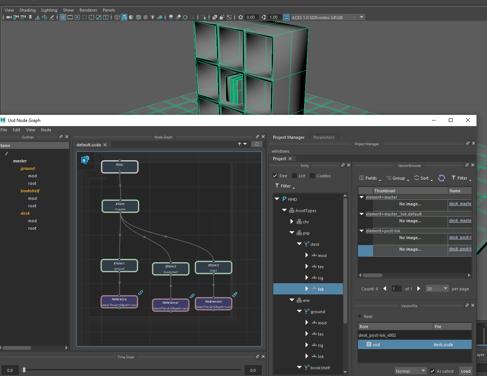

### Usd init

After open work file, you just need to use this tool to set the edit layer.
Otherwise, you may work in a wrong layer.

### Usd commit

After editing the usd stage, use this tool to save the changes.

### Usd push

Use this tool and publish the usd stage changes.

